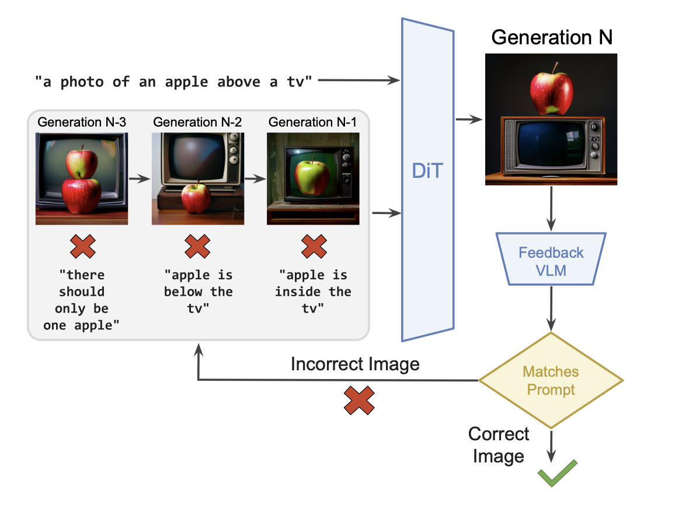

# Reflect-DiT: Inference-Time Scaling for Text-to-Image Diffusion Transformers via In-Context Reflection
[[Paper]](https://arxiv.org/abs/2503.12271)[[Checkpoint]](https://huggingface.co/jacklishufan/reflect-dit)[[Data(w/o Training Images)]](https://huggingface.co/datasets/jacklishufan/reflect-DiT) [[Training Images]](https://huggingface.co/datasets/KonstantinosKK/reflect-dit-train-images)

This repo contains official implementation of [Reflect-DiT: Inference-Time Scaling for Text-to-Image Diffusion Transformers via In-Context Reflection](https://arxiv.org/abs/2503.12271)




## Installation

1. Install the Sana following instructions from the [official repo](https://github.com/NVlabs/Sana/tree/32f495b5b2a464ad3dbbccdc763ec276e881dc05). We use the commit id `32f495b5b2a464ad3dbbccdc763ec276e881dc05` in our experiments. Future verisons may also work, but is untested.

2. Install additional dependencies

```
pip install -r requirements.txt
```

## Downloading Checkpoints

Please download Checkpoints from [our huggingface repo](https://huggingface.co/jacklishufan/reflect-dit/tree/main/dit/transformer). If you want to run evalutions on GenEval benchmark, please also download the object detector using the [official script](https://github.com/djghosh13/geneval/blob/main/evaluation/download_models.sh). Additionally, please download Sana 1.0 base model from [huggingface](https://huggingface.co/Efficient-Large-Model/Sana_1600M_1024px_MultiLing_diffusers)

After downloading all checkpoints, place it in the following structure

```
-<repo root>
---ckpts
    --geneval-det // geneval detector
        --mask2former_swin-s-p4-w7-224_lsj_8x2_50e_coco.pth
    --release_weights //our repo
        --dit
        --vlm
    --Sana_1600M_1024px_MultiLing_diffusers //official Sana weight
```

## Downloading Training and Evaluation Data (Optional)

Please download our evaluation data from [this repo](https://huggingface.co/datasets/jacklishufan/reflect-DiT/tree/main).

Additionally, to reproduce training runs, please download images from [this google drive](https://drive.google.com/file/d/11kHKUKOGI417HoNKJr84v1Ht3HU6R_yG/view?usp=drivesdk)

After downloading all the data, organize it in the following structure

```
-<repo root>
---data
    --custom 
        --example.csv
    --dpg 
       ...
       // we provide dpg bench prompts here, alongside our subsets used in appendix table 6
    --dit
        --gen_eval_sana_train 
        //this is the folder created by untaring the images
        --object_self_correct_cleaned.csv
    --vlm
        --vllm.json
    --geneval
        --evaluation_metadata.jsonl
        --object_names.txt
    --Sana_1600M_1024px_MultiLing_diffusers //official Sana weight
    --gen_eval_sana-join-4 
    //this is the folder created by untaring gen_eval_sana-join-4.tar
    //it contains our generated images to reproduce paper results
```

## Setup Inference Data (Non-Optional!)

If you have downloaded training data, there is nothing to be done in this step, as you have set up `data` folder properly. If you just want to run inference, please create a `data` folder with following structure

```
-<repo root>
---data
    --custom 
        --example.csv
```

where `example.csv` can be found in `custom_data` folder of this repo

## Run Inference on Custom Prompts

Run the command 

```
bash inference_scripts/eval_custom.sh
```

You can add custom prompts to `example.csv`

## Run Evaluation on Benchmarks

First, run the command to generate images

```
bash inference_scripts/eval_geneval.sh
or 
bash inference_scripts/eval_dpg.sh
```

After that, you can run `python inference_scripts/analysis.py path/to/output` to get the metrics. 

As an example, to reproduce main results of the paper, please run the following command after downloading the evaluation data

```
$python inference_scripts/analysis.py data/gen_eval_sana-join-4
data/gen_eval_sana-join-4

+------------+--------------------+----------+----------+---------------+--------------------+--------------------+
| color_attr |       colors       | counting | position | single_object |     two_object     |      overall       |
+------------+--------------------+----------+----------+---------------+--------------------+--------------------+
|    0.6     | 0.8829787234042553 |   0.8    |   0.66   |     0.975     | 0.9595959595959596 | 0.8065099457504521 |
+------------+--------------------+----------+----------+---------------+--------------------+--------------------+
+--------------------+--------------------+--------------------+--------------------+--------------------+
|        N=4         |        N=8         |        N=12        |        N=16        |        N=20        |
+--------------------+--------------------+--------------------+--------------------+--------------------+
| 0.7757685352622061 | 0.7920433996383364 | 0.7992766726943942 | 0.7992766726943942 | 0.8065099457504521 |
+--------------------+--------------------+--------------------+--------------------+--------------------+
```


## Run Training (DiT)

Assuming the data and environment is set up properly as described above, You can run the following command to reproduce the training

```
bash train_scripts/train_reflect_dit.sh
```

## Run Training (VLM Reward Model)

We provide training data in `data/vlm` in LLAVA Format. The training images is the same as DiT and is placed at `data/dit/gen_eval_sana_train`.

You can use any codebase that supports this data format to train VLM, such as [This repo](https://github.com/zhangfaen/finetune-Qwen2-VL)

## Common Issues

1. I see `libpng error` for `GenEval`

Some times `mmcv`, which is used in GenEval evaluation does not load `png` properly. To fix this, add `--fmt jpg` to your inference script

2. Where to place `MPLUG` used in DPG-Bench Eval?

It will be automatically downloaded by `modelscope` package. Hence, we did not explictly write it here. Please install `modelscope` from [Official repo](https://github.com/modelscope/modelscope) for DPG-Bench experiments.

3. Where are the Hard subsets of DPG-Bench mentioned in the paper?

Its in `data/dpg/subsets`
